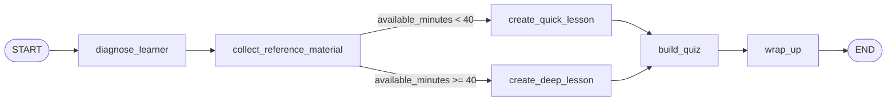

## Storybook Team

OpenAI API와 Google ADK Workflow Agent를 조합한 어린이 동화책 파이프라인입니다.

구성:

- `SequentialAgent`: 전체 흐름을 관리합니다.
- `StoryWriterAgent`: OpenAI `Responses API`로 5페이지 동화를 만들고 state에 저장합니다.
- `ParallelAgent`: 5개의 페이지 삽화 에이전트를 동시에 실행합니다.
- `IllustratorPage1~5Agent`: OpenAI `Images API`로 각 페이지 삽화를 생성하고 artifact로 저장합니다.
- `BookAssemblerAgent`: 스토리 텍스트와 삽화 artifact를 합쳐 최종 동화책 markdown을 만듭니다.
- `Callbacks`: 진행 상태를 state에 기록하고 단계 완료 메시지를 Web UI에 보여줍니다.

구현 위치:

- `storybook_team/agent.py`
- `storybook_team/prompts.py`

## Pipeline

```text
[사용자 입력]
    ↓
[SequentialAgent]
    ↓
[StoryWriterAgent]
    - 5페이지 동화 작성
    - state: storybook_story_json
    ↓
[ParallelAgent]
    - 5개 삽화 동시 생성
    - artifacts: page_01.png ... page_05.png
    - state: storybook_illustrations
    ↓
[BookAssemblerAgent]
    - 최종 동화책 markdown 조립
    - state: storybook_final_book
```

진행 로그는 `storybook_progress_log`에 저장됩니다.

## Setup

```bash
uv sync
```

환경 변수:

```bash
export OPENAI_API_KEY="your-openai-api-key"
```

선택 설정:

```bash
export STORYBOOK_TEXT_MODEL="gpt-5-mini"
export STORYBOOK_IMAGE_MODEL="gpt-image-1"
```

OpenAI 호환 게이트웨이를 쓰는 경우:

```bash
export OPENAI_BASE_URL="https://your-endpoint.example.com/v1"
```

## Test With ADK Web

```bash
uv run adk web
```

브라우저에서 Web UI를 열고 `storybook_team`을 선택한 뒤 입력합니다.

데모 1:

```text
용감한 아기 고양이 이야기로 5페이지 동화책을 만들어줘.
```

데모 2:

```text
별빛 정원을 지키는 아기 토끼 이야기로 5페이지 동화책을 만들어줘.
```

Web UI에서 기대 결과:

- 스토리 작성 단계 완료 메시지 표시
- 이미지 1/5 ~ 5/5 생성 완료 메시지 표시
- 최종 응답에 제목, 5페이지 텍스트, 각 페이지 삽화 파일명 포함
- artifact에 `page_01.png` 같은 이미지 파일 저장

## Stored Outputs

- `storybook_story_json`: 5페이지 동화 JSON
- `storybook_illustrations`: 페이지별 삽화 메타데이터
- `storybook_progress_log`: 진행 로그
- `storybook_final_book`: 완성된 동화책 markdown

## Education Agent

`education_agent.py`는 LangGraph 기반의 EduPath Coach 구현입니다.

목적:

- 학습자의 주제, 목표, 수준, 가용 시간을 입력받아 맞춤형 학습 경로와 미니 레슨, 퀴즈, 최종 피드백을 생성합니다.

요구사항 반영:

- 최소 3개 노드 구현: 총 6개 노드 사용
- 최소 1개 Conditional Edge 구현: 학습 가능 시간에 따라 분기
- 최소 1개 Tool 연동: 로컬 파일 검색 기반 커스텀 툴 사용

구성 노드:

- `diagnose_learner`: 학습 수준과 시간을 바탕으로 학습 공백과 계획을 생성
- `collect_reference_material`: 커스텀 툴로 주제별 학습 레퍼런스를 조회
- `create_quick_lesson`: 시간이 부족할 때 짧은 학습 요약 생성
- `create_deep_lesson`: 시간이 충분할 때 심화 학습 요약 생성
- `build_quiz`: 레슨과 레퍼런스를 바탕으로 확인 문제 3개 생성
- `wrap_up`: 다음 학습 행동을 한 문장으로 정리

그래프 구조:



Tool 설명:

- `search_learning_reference`: [education_reference_notes.json](/Users/bcc/robustlab/ai-engineer-club/ai2_0to2_2/education_reference_notes.json) 에서 주제별 학습 참고 문장을 검색합니다.
- 이 툴의 결과는 `collect_reference_material` 노드에서 호출되며, `lesson_summary`와 `quiz` 생성에 반영됩니다.

구현 파일:

- [education_agent.py](/Users/bcc/robustlab/ai-engineer-club/ai2_0to2_2/education_agent.py)
- [education_reference_notes.json](/Users/bcc/robustlab/ai-engineer-club/ai2_0to2_2/education_reference_notes.json)

실행:

```bash
python education_agent.py
```

예시 입력:

- `topic="Python 함수"`
- `goal="함수를 직접 정의하고 호출할 수 있다"`
- `learner_level="beginner"`
- `available_minutes=30`

기대 결과:

- 학습 공백 진단
- `quick` 또는 `deep` 경로 선택
- 참고 자료가 포함된 미니 레슨 생성
- 3개 퀴즈 생성
- 최종 학습 피드백 반환
